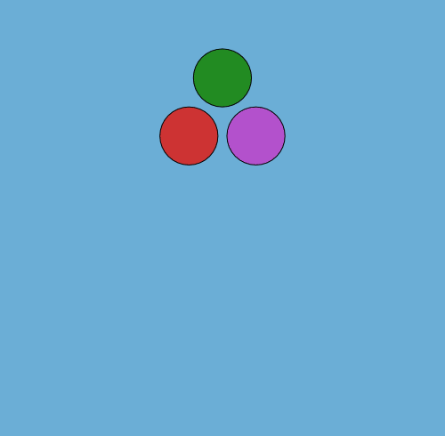

# WaterLily.jl

<!--


 -->
<!---[](https://travis-ci.com/gabrielweymouth/WaterLily.jl) --->
[](https://github.com/Zitzeronion/WaterLily.jl/actions)
[](http://codecov.io/github/gabrielweymouth/WaterLily.jl?branch=master)
<!--
[](https://gabrielweymouth.github.io/WaterLily.jl/stable)
[](https://gabrielweymouth.github.io/WaterLily.jl/dev)
-->



## Overview

WaterLily.jl is a real-time fluid simulator written in pure Julia. This is an experimental project to take advantage of the active scientific community in Julia to accelerate and enhance fluid simulations. If you want to play around with a much more fully developed and documented solver right now, you should head over to [LilyPad](https://github.com/weymouth/lily-pad).

## Method/capabilities

WaterLily.jl solves the unsteady incompressible 2D or 3D [Navier-Stokes equations](https://en.wikipedia.org/wiki/Navier%E2%80%93Stokes_equations) on a Cartesian grid. The pressure Poisson equation is solved with a [geometric multigrid](https://en.wikipedia.org/wiki/Multigrid_method) method. Solid boundaries are modelled using the [Boundary Data Immersion Method](https://eprints.soton.ac.uk/369635/).

## Examples

The user can set the boundary conditions, the initial velocity field, the fluid viscosity (which determines the [Reynolds number](https://en.wikipedia.org/wiki/Reynolds_number)), and immerse solid obstacles using a signed distance function. These examples and others are found in the [examples](examples).

### Flow over a circle
We define the size of the simulation domain as `n`x`m` cells. The circle has radius `R=m/8` and is centered at `[m/2,m/2]`. The flow boundary conditions are `[U=1,0]` and Reynolds number is `Re=UR/ν` where `ν` (Greek "nu" U+03BD, not Latin lowercase "v") is the kinematic viscosity of the fluid. 
```julia
using WaterLily
using LinearAlgebra: norm2

function circle(n,m;Re=250)
    # Set physical parameters
    U,R,center = 1., m/8., [m/2,m/2]
    ν=U*R/Re
    @show R,ν

    body = AutoBody((x,t)->norm2(x .- center) - R)
    Simulation((n+2,m+2), [U,0.], R; ν, body)
end
```
The second to last line defines the circle geometry using a signed distance function. The `AutoBody` function uses [automatic differentiation](https://github.com/JuliaDiff/) to infer the other geometric parameter automatically. Replace the circle's distance function with any other, and now you have the flow around something else... such as a [donut](examples/ThreeD_donut.jl), a [block](examples/TwoD_block.jl) or the [Julia logo](examples/TwoD_Julia.jl). Finally, the last line defines the `Simulation` by passing in the `dims=(n+2,m+2)` and the other parameters we've defined.

Now we can create a simulation (first line) and run it forward in time (third line)
```julia
circ = circle(3*2^6,2^7);
t_end = 10;
sim_step!(circ,t_end)
```
Note we've set `n,m` to be multiples of powers of 2, which is important when using the (very fast) Multi-Grid solver. We can now access and plot whatever variables we like. For example, we could print the velocity at `I::CartesianIndex` using `println(circ.flow.u[I])` or plot the whole pressure field using
```julia
using Plots
contour(circ.flow.p')
```
A set of [flow metric functions](src/Metrics.jl) have been implemented and the examples use these to make gifs such as the one above.

### 3D Taylor Green Vortex
You can also simulate a nontrivial initial velocity field by passing in a vector function.
```julia
function TGV(p=6,Re=1e5)
    # Define vortex size, velocity, viscosity
    L = 2^p; U = 1; ν = U*L/Re

    function uλ(i,vx)                          # vector function
        x,y,z = @. (vx-1.5)*π/L                # scaled coordinates
        i==1 && return -U*sin(x)*cos(y)*cos(z) # u_x
        i==2 && return  U*cos(x)*sin(y)*cos(z) # u_y
        return 0.                              # u_z
    end

    # Initialize simulation
    Simulation((L+2,L+2,L+2), zeros(3), L; uλ, ν, U)
end
```
The velocity field is defined by the vector component `i` and the 3D position vector `vx`. We scale the coordinates so the velocity will be zero on the domain boundaries and then check which component is needed and return the correct expression.

### Moving bodies


You can simulate moving bodies in Waterlily by passing a coordinate `map` to `AutoBody` in addition to the `sdf`. 
```julia
using LinearAlgebra: norm2
using StaticArrays
function hover(L=2^5;Re=250,U=1,amp=0,thk=1+√2)
    # Set viscosity
    ν=U*L/Re
    @show L,ν

    # Create dynamic block geometry
    function sdf(x,t)
        y = x .- SVector(0.,clamp(x[2],-L/2,L/2))
        norm2(y)-thk/2
    end
    function map(x,t)
        α = amp*cos(t*U/L); R = @SMatrix [cos(α) sin(α); -sin(α) cos(α)]
        R * (x.-SVector(3L+L*sin(t*U/L)+0.01,4L))
    end
    body = AutoBody(sdf,map)

    Simulation((6L+2,6L+2),zeros(2),L;U,ν,body,ϵ=0.5)
end
```
How to generate a .gif from this can be seen in the examples folder [TwoD_block.jl](https://github.com/weymouth/WaterLily.jl/blob/master/examples/TwoD_block.jl).
In this case, the `sdf` defines a line segment from `-L/2 ≤ x[2] ≤ L/2` with a thickness `thk`. To make the line segment move, we define a coordinate tranformation function `map(x,t)`. In this example, the coordinate `x` is shifted by `(3L,4L)` at time `t=0`, which moves the center of the segment to this point. However, the horizontal shift varies harmonically in time, sweeping the segment left and right during the simulation. The example also rotates the segment using the rotation matrix `R = [cos(α) sin(α); -sin(α) cos(α)]` where the angle `α` is also varied harmonically. The combined result is a thin flapping line, similar to a cross-section of a hovering insect wing.

One important thing to note here is the use of `StaticArrays` to define the `sdf` and `map`. This speeds up the simulation around a factor of 10 compared to using normal arrays since it reduces the number of allocations needed for every point at every time step. Hopefully, we'll get the allocations down to zero soon. 

## Development goals
 - Immerse obstacles defined by 3D meshes or 2D lines using [GeometryBasics](https://github.com/JuliaGeometry/GeometryBasics.jl).
 - GPU acceleration with [CUDA.jl](https://github.com/JuliaGPU/CUDA.jl).
 - Split multigrid method into its own repository, possibly merging with [AlgebraicMultigrid](https://github.com/JuliaLinearAlgebra/AlgebraicMultigrid.jl) or [IterativeSolvers](https://github.com/JuliaMath/IterativeSolvers.jl).
