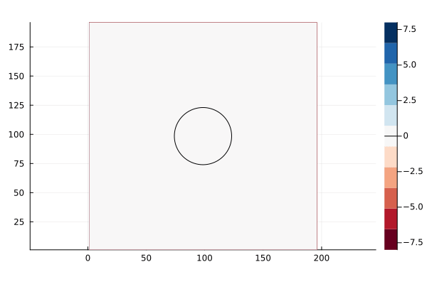

# WaterLily.jl

[](https://weymouth.github.io/WaterLily.jl/dev/)
[](https://github.com/weymouth/WaterLily.jl/actions)
[](https://codecov.io/gh/weymouth/WaterLily.jl)


## Overview

WaterLily.jl is a simple and fast fluid simulator written in pure Julia. This is an experimental project to take advantage of the active scientific community in Julia to accelerate and enhance fluid simulations. Watch the JuliaCon2021 talk here:

[](https://youtu.be/YsPkfZqbNSQ)

## Method/capabilities

WaterLily.jl solves the unsteady incompressible 2D or 3D [Navier-Stokes equations](https://en.wikipedia.org/wiki/Navier%E2%80%93Stokes_equations) on a Cartesian grid. The pressure Poisson equation is solved with a [geometric multigrid](https://en.wikipedia.org/wiki/Multigrid_method) method. Solid boundaries are modelled using the [Boundary Data Immersion Method](https://eprints.soton.ac.uk/369635/). The solver can run on serial CPU, multi-threaded CPU, or GPU backends.

## Examples

The user can set the boundary conditions, the initial velocity field, the fluid viscosity (which determines the [Reynolds number](https://en.wikipedia.org/wiki/Reynolds_number)), and immerse solid obstacles using a signed distance function. These examples and others are found in the [examples](examples).

### Flow over a circle
We define the size of the simulation domain as `n`x`m` cells. The circle has radius `m/8` and is centered at `(m/2,m/2)`. The flow boundary conditions are `(U=1,0)` and Reynolds number is `Re=U*radius/ν` where `ν` (Greek "nu" U+03BD, not Latin lowercase "v") is the kinematic viscosity of the fluid.
```julia
using WaterLily
function circle(n,m;Re=250,U=1)
    radius, center = m/8, m/2
    body = AutoBody((x,t)->√sum(abs2, x .- center) - radius)
    Simulation((n,m), (U,0), radius; ν=U*radius/Re, body)
end
```
The second to last line defines the circle geometry using a [signed distance function](https://en.wikipedia.org/wiki/Signed_distance_function#Applications). The `AutoBody` function uses [automatic differentiation](https://github.com/JuliaDiff/) to infer the other geometric parameter automatically. Replace the circle's distance function with any other, and now you have the flow around something else... such as a [donut](examples/ThreeD_donut.jl) or the [Julia logo](examples/TwoD_Julia.jl). Finally, the last line defines the `Simulation` by passing in parameters we've defined.

Now we can create a simulation (first line) and run it forward in time (third line)
```julia
circ = circle(3*2^6,2^7)
t_end = 10
sim_step!(circ,t_end)
```
Note we've set `n,m` to be multiples of powers of 2, which is important when using the (very fast) Multi-Grid solver. We can now access and plot whatever variables we like. For example, we could print the velocity at `I::CartesianIndex` using `println(circ.flow.u[I])` or plot the whole pressure field using
```julia
using Plots
contour(circ.flow.p')
```
A set of [flow metric functions](src/Metrics.jl) have been implemented and the examples use these to make gifs such as the one above.

### 3D Taylor Green Vortex
The three-dimensional [Taylor Green Vortex](examples/ThreeD_TaylorGreenVortex.jl) demonstrates many of the other available simulation options. First, you can simulate a nontrivial initial velocity field by passing in a vector function `uλ(i,xyz)` where `i ∈ (1,2,3)` indicates the velocity component `uᵢ` and `xyz=[x,y,z]` is the position vector.
```julia
function TGV(; pow=6, Re=1e5, T=Float64, mem=Array)
    # Define vortex size, velocity, viscosity
    L = 2^pow; U = 1; ν = U*L/Re
    # Taylor-Green-Vortex initial velocity field
    function uλ(i,xyz)
        x,y,z = @. (xyz-1.5)*π/L               # scaled coordinates
        i==1 && return -U*sin(x)*cos(y)*cos(z) # u_x
        i==2 && return  U*cos(x)*sin(y)*cos(z) # u_y
        return 0.                              # u_z
    end
    # Initialize simulation
    return Simulation((L, L, L), (0, 0, 0), L; U, uλ, ν, T, mem)
end
```
This example also demonstrates the floating point type (`T=Float64`) and array memory type (`mem=Array`) options. For example, to run on an NVIDIA GPU we only need to import the [CUDA.jl](https://github.com/JuliaGPU/CUDA.jl) library and initialize the `Simulation` memory on that device.
```julia
import CUDA
@assert CUDA.functional()
vortex = TGV(T=Float32,mem=CUDA.CuArray)
sim_step!(vortex,1)
```
For an AMD GPU, use `import AMDGPU` and `mem=AMDGPU.ROCArray`. Note that Julia 1.9 is required for AMD GPUs.

### Moving bodies


You can simulate moving bodies in Waterlily by passing a coordinate `map` to `AutoBody` in addition to the `sdf`.
```julia
using StaticArrays
function hover(L=2^5;Re=250,U=1,amp=π/4,ϵ=0.5,thk=2ϵ+√2)
    # Line segment SDF
    function sdf(x,t)
        y = x .- SA[0,clamp(x[2],-L/2,L/2)]
        √sum(abs2,y)-thk/2
    end
    # Oscillating motion and rotation
    function map(x,t)
        α = amp*cos(t*U/L); R = SA[cos(α) sin(α); -sin(α) cos(α)]
        R * (x - SA[3L-L*sin(t*U/L),4L])
    end
    Simulation((6L,6L),(0,0),L;U,ν=U*L/Re,body=AutoBody(sdf,map),ϵ)
end
```
In this example, the `sdf` function defines a line segment from `-L/2 ≤ x[2] ≤ L/2` with a thickness `thk`. To make the line segment move, we define a coordinate tranformation function `map(x,t)`. In this example, the coordinate `x` is shifted by `(3L,4L)` at time `t=0`, which moves the center of the segment to this point. However, the horizontal shift varies harmonically in time, sweeping the segment left and right during the simulation. The example also rotates the segment using the rotation matrix `R = [cos(α) sin(α); -sin(α) cos(α)]` where the angle `α` is also varied harmonically. The combined result is a thin flapping line, similar to a cross-section of a hovering insect wing.

One important thing to note here is the use of `StaticArrays` to define the `sdf` and `map`. This speeds up the simulation since it eliminates allocations at every grid cell and time step.

### [Circle inside an oscillating flow](https://github.com/weymouth/WaterLily.jl/blob/master/examples/TwoD_oscillatingFlowOverCircle.jl)


This [example](examples/TwoD_oscillatingFlowOverCircle.jl) demonstrates a 2D oscillating periodic flow over a circle.
```julia
function circle(n,m;Re=250,U=1)
    # define a circle at the domain center
    radius = m/8
    body = AutoBody((x,t)->√sum(abs2, x .- (n/2,m/2)) - radius)

    # define time-varying body force `g` and periodic direction `perdir`
    accelScale, timeScale = U^2/2radius, radius/U
    g(i,t) = i==1 ? -2accelScale*sin(t/timeScale) : 0 
    Simulation((n,m), (U,0), radius; ν=U*radius/Re, body, g, perdir=(1,))
end
```
The `g` argument accepts a function with direction (`i`) and time (`t`) arguments. This allows you to create a spatially uniform body force with variations over time. In this example, the function adds a sinusoidal force in the "x" direction `i=1`, and nothing to the other directions.

The `perdir` argument is a tuple that specifies the directions to which periodic boundary conditions should be applied. Any number of directions may be defined as periodic, but in this example only the `i=1` direction is used allowing the flow to accelerate freely in this direction.

### [Accelerating reference frame](https://github.com/weymouth/WaterLily.jl/blob/master/examples/TwoD_SlowStartCircle.jl)


WaterLily gives the posibility to set up a `Simulation` using time-varying boundary conditions for the velocity field. This can be used to simulate a flow in an accelerating reference frame. The following example demonstrates how to set up a `Simulation` with a time-varying velocity field.
```julia
using WaterLily
# define time-varying velocity boundary conditions
Ut(i,t::T;a0=0.5) where T = i==1 ? convert(T, a0*t) : zero(T)
# pass that to the function that creates the simulation
sim = Simulation((256,256), Ut, 32)
```
The `Ut` function is used to define the time-varying velocity field. In this example, the velocity in the "x" direction is set to `a0*t` where `a0` is the acceleration of the reference frame. The `Simulation` function is then called with the `Ut` function as the second argument. The simulation will then run with the time-varying velocity field.


### [Periodic and convective boundary conditions](https://github.com/weymouth/WaterLily.jl/blob/master/examples/TwoD_circle_periodicBC_convectiveBC.jl)


In addition to the standard free-slip (or reflective) boundary conditions, WaterLily also supports periodic boundary conditions. The following example demonstrates how to set up a `Simulation` with periodic boundary conditions in the "y" direction.

```julia
using WaterLily,StaticArrays

# sdf an map for a moving circle in y-direction
function sdf(x,t)
    norm2(SA[x[1]-192,mod(x[2]-384,384)-192])-32
end
function map(x,t)
    x.-SA[0.,t/2]
end

# make a body
body = AutoBody(sdf, map)

# y-periodic boundary conditions
Simulation((512,384), (1,0), 32; body, perdir=(2,))
```

Additionally, the flag `exitBC=true` can be passed to the `Simulation` function to enable convective boundary conditions. This will apply a 1D convective exit in the __`x`__ direction (there is not way to change this at the moment). The `exitBC` flag is set to `false` by default. In this case, the boundary condition is set to the corresponding value of the `u_BC` vector you specified when constructing the `Simulation`.

```julia
using WaterLily

# make a body
body = AutoBody(sdf, map)

# y-periodic boundary conditions
Simulation((512,384), u_BC=(1,0), L=32; body, exitBC=true)
```


### [Writing to a VTK file](https://github.com/weymouth/WaterLily.jl/blob/master/examples/ThreeD_cylinder_vtk_restart.jl)

The following example demonstrates how to write simulation data to a `.pvd` file using the `WriteVTK` package and the WaterLily `vtkwriter` function. The simplest writer can be instantiated with

```julia
using WaterLily,WriteVTK

# make a sim
sim = make_sim(...)

# make a writer
writer = vtkwriter("simple_writer")

# write the data
write!(writer,sim)

# don't forget to close the file
close(writer)
```
This would write the velocity and pressure fields to a file named `simmple_writer.pvd`. The `vtkwriter` function can also take a dictionary of custom attributes to write to the file. For example, to write the body (sdf) and λ₂ fields to the file, you could use the following code:
```julia
using WaterLily,WriteVTK

# make a writer with some attributes, need to output to CPU array to save file (|> Array)
velocity(a::Simulation) = a.flow.u |> Array;
pressure(a::Simulation) = a.flow.p |> Array;
_body(a::Simulation) = (measure_sdf!(a.flow.σ, a.body, WaterLily.time(a)); 
                                     a.flow.σ |> Array;)
lamda(a::Simulation) = (@inside a.flow.σ[I] = WaterLily.λ₂(I, a.flow.u);
                        a.flow.σ |> Array;)
                        
# this maps field names to values in the file
custom_attrib = Dict(
    "Velocity" => velocity,
    "Pressure" => pressure,
    "Body" => _body,
    "Lambda" => lamda
)

# make the writer
writer = vtkWriter("advanced_writer"; attrib=custom_attrib)
...
close(writer)
```
The functions that are passed to the `attrib` (custom attributes) must follow the same structure as what is shown in this example, that is, given a `Simulation`, return a N-dimensional (scalar or vector) field. The `vtkwriter` function will automatically write the data to a `.pvd` file, which can be read by Paraview. The prototype for the `vtkwriter` function is:
```julia
# prototype vtk writer function
custom_vtk_function(a::Simulation) = ... |> Array
```
the `...` should be replaced with the code that generates the field you want to write to the file. The piping to a (CPU) `Array` is necessary to ensure that the data is written to the CPU before being written to the file for GPU simulations.


### [Restarting from a VTK file](https://github.com/weymouth/WaterLily.jl/blob/master/examples/ThreeD_cylinder_vtk_restart.jl)

This capability is very usefull to restart a simulation from a previous state. The `ReadVTK` package is used to read simulation data from a `.pvd` file. This `.pvd` __must__ have been writen with the `vtkwriter` function and __must__ contain at least the `velocity` and `pressure` fields. The following example demonstrates how to restart a simulation from a `.pvd` file using the `ReadVTK` package and the WaterLily `vtkreader` function
```julia
using WaterLily,ReadVTK
sim = make_sim(...)
# restart the simulation
writer = restart_sim!(sim; fname="file_restart.pvd")

# this acctually append the data to the file used to restart
write!(writer, sim)

# don't forget to close the file
close(writer)
```
Internally, this function reads the last file in the `.pvd` file and use that to set the `velocity` and `pressure` fields in the simulation. The `sim_time` is also set to the last value saved in the `.pvd` file. The function also returns a `vtkwriter` that will append the new data to the file used to restart the simulation. __Note__ the `sim` that will be filled must be identical to the one saved to the file for this restart to work, that is, the same size, same body, etc.

## Multi-threading and GPU backends

WaterLily uses [KernelAbstractions.jl](https://github.com/JuliaGPU/KernelAbstractions.jl) to multi-thread on CPU and run on GPU backends. The implementation method and speed-up are documented in our [ParCFD abstract](https://arxiv.org/abs/2304.08159). In summary, a single macro `WaterLily.@loop` is used for nearly every loop in the code base, and this uses KernelAbstractactions to generate optimized code for each back-end. The speed-up is more pronounce for large simulations, and we've [benchmarked](benchmark/donut/donut.jl) up to 23x-speed up on a Intel Core i7-10750H x6 processor, and 182x speed-up NVIDIA GeForce GTX 1650 Ti GPU card.

Note that multi-threading requires _starting_ Julia with the  `--threads` argument, see [the multi-threading section](https://docs.julialang.org/en/v1/manual/multi-threading/) of the manual. If you are running Julia with multiple threads, KernelAbstractions will detect this and multi-thread the loops automatically. As in the Taylor-Green-Vortex examples above, running on a GPU requires initializing the `Simulation` memory on the GPU, and care needs to be taken to move the data back to the CPU for visualization. See [jelly fish](examples/ThreeD_jelly.jl) for another non-trivial example.

Finally, KernelAbstractions does incur some CPU allocations for every loop, but other than this `sim_step!` is completely non-allocating. This is one reason why the speed-up improves as the size of the simulation increases.

## Development goals
 - Immerse obstacles defined by 3D meshes using [GeometryBasics](https://github.com/JuliaGeometry/GeometryBasics.jl).
 - Multi-CPU/GPU simulations.
 - Add free-surface physics with Volume-of-Fluid or Level-Set.
 - Add external potential-flow domain boundary conditions.

If you have other suggestions or want to help, please raise an issue on github.
