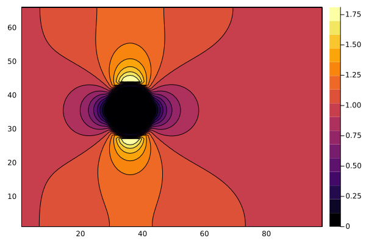

# WaterLily.jl

[](https://WaterLily-jl.github.io/WaterLily.jl/dev/)
[](https://github.com/WaterLily-jl/WaterLily.jl/actions)
[](https://codecov.io/gh/WaterLily-jl/WaterLily.jl)


## Overview

**WaterLily.jl** is a simple and fast fluid simulator written in pure Julia. This project is supported by awesome libraries developed within the Julia scientific community, and it aims to accelerate and enhance fluid simulations. Watch the JuliaCon2024 talk here:

[](https://www.youtube.com/live/qru5G5Yp77E?t=29074s)

If you have used WaterLily for research, please __cite us__! The [2024 paper](https://physics.paperswithcode.com/paper/waterlily-jl-a-differentiable-and-backend) describes the main features of the solver and provides benchmarking, validation, and profiling results.
```
@misc{WeymouthFont2024,
    title         = {WaterLily.jl: A differentiable and backend-agnostic Julia solver to simulate incompressible viscous flow and dynamic bodies},
    author        = {Gabriel D. Weymouth and Bernat Font},
    url           = {https://arxiv.org/abs/2407.16032},
    eprint        = {2407.16032},
    archivePrefix = {arXiv},
    year          = {2024},
    primaryClass  = {physics.flu-dyn}
}
```

## Method/capabilities

WaterLily solves the unsteady incompressible 2D or 3D [Navier-Stokes equations](https://en.wikipedia.org/wiki/Navier%E2%80%93Stokes_equations) on a Cartesian grid. The pressure Poisson equation is solved with a [geometric multigrid](https://en.wikipedia.org/wiki/Multigrid_method) method. Solid boundaries are modelled using the [Boundary Data Immersion Method](https://eprints.soton.ac.uk/369635/). The solver can run on serial CPU, multi-threaded CPU, or GPU backends.

## Example: Flow over a circle

WaterLily lets the user can set the domain size and boundary conditions, the fluid viscosity (which determines the [Reynolds number](https://en.wikipedia.org/wiki/Reynolds_number)), and immerse solid obstacles. A large selection of examples, notebooks, and tutorials are found in the [WaterLily-Examples](https://github.com/WaterLily-jl/WaterLily-Examples) repository. Here, we will illustrate the basics by simulating and plotting the flow over a circle.

We define the size of the simulation domain as `n`$\times$`m` cells. The circle has radius `m/8` and is centered at `(m/2,m/2)`. The flow boundary conditions are `(U,0)`, where we set `U=1`, and the Reynolds number is `Re=U*radius/ν` where `ν` (Greek "nu" U+03BD, not Latin lowercase "v") is the kinematic viscosity of the fluid.
```julia
using WaterLily
function circle(n,m;Re=250,U=1)
    # signed distance function to circle
    radius, center = m/8, m/2-1
    sdf(x,t) = √sum(abs2, x .- center) - radius

    Simulation((n,m),   # domain size 
               (U,0),   # domain velocity (& velocity scale)
               2radius; # length scale
               ν=U*2radius/Re,     # fluid viscosity 
               body=AutoBody(sdf)) # geometry
end
```
The circle geometry is defined using a [signed distance function](https://en.wikipedia.org/wiki/Signed_distance_function#Applications). The `AutoBody` function uses [automatic differentiation](https://github.com/JuliaDiff/) to infer the other geometric parameters of the body automatically. Replace the circle's distance function with any other, and now you have the flow around something else... such as a [donut](https://github.com/WaterLily-jl/WaterLily-Examples/blob/main/examples/ThreeD_Donut.jl) or the [Julia logo](https://github.com/WaterLily-jl/WaterLily-Examples/blob/main/examples/TwoD_Julia.jl). For more complex geometries, [ParametricBodies.jl](https://github.com/WaterLily-jl/ParametricBodies.jl) defines a `body` using any parametric curve, such as a spline. See that repo (and the video above) for examples. 

The code block above return a `Simulation` with the parameters we've defined. Now we can initialize a simulation (first line) and step it forward in time (second line)
```julia
circ = circle(3*2^5,2^6)
sim_step!(circ)
```
Note we've set `n,m` to be multiples of powers of 2, which is important when using the (very fast) geometric multi-grid solver.

We can now access and plot whatever variables we like. For example, we can plot the x-component of the velocity field using
```julia
using Plots
u = circ.flow.u[:,:,1] # first component is x
contourf(u') # transpose the array for the plot
```


As you can see, the velocity within the circle is zero, the velocity far from the circle is one, and there are accelerated and decelerated regions around the circle. The `sim_step!` has only taken a single time step, and this initial flow around our circle looks similar to the potential flow because the viscous boundary layer has not separated yet. 

A set of [flow metric functions](https://github.com/WaterLily-jl/WaterLily.jl/blob/master/src/Metrics.jl) have been implemented, and we can use them to measure the simulation. The following code block defines a function to step the simulation to time `t` and then use the `pressure_force` metric to measure the force on the immersed body. The function is applied over a time range, and the forces are plotted. 
```Julia
function get_forces!(sim,t)
    sim_step!(sim,t,remeasure=false)
    force = WaterLily.pressure_force(sim)
    force./(0.5sim.L*sim.U^2) # scale the forces!
end

# Simulate through the time range and get forces
time = 1:0.1:50 # time scale is sim.L/sim.U
forces = [get_forces!(circ,t) for t in time];

#Plot it
plot(time,[first.(forces), last.(forces)], 
    labels=permutedims(["drag","lift"]),
    xlabel="tU/L",
    ylabel="Pressure force coefficients")
```


We can also plot the vorticity field instead of the u-velocity to see a snap-shot of the wake.

```julia
# Use curl(velocity) to compute vorticity `inside` the domain
ω = zeros(size(u));
@inside ω[I] = WaterLily.curl(3,I,circ.flow.u)*circ.L/circ.U

# Plot it
clims = (-6,6)
contourf(clamp.(ω,clims...)'; clims,
    color=palette(:RdBu,9),linewidth=0,levels=8,
    aspect_ratio=:equal,border=:none)
```


As you can see, WaterLily correctly predicts that the flow is unsteady, with an alternating vortex street wake, leading to an oscillating side force and drag force.

## Multi-threading and GPU backends

WaterLily uses [KernelAbstractions.jl](https://github.com/JuliaGPU/KernelAbstractions.jl) to multi-thread on CPU and run on GPU backends. The implementation method and speed-up are documented in the [2024 paper](https://physics.paperswithcode.com/paper/waterlily-jl-a-differentiable-and-backend), with costs as low as 1.44 nano-seconds measured per degree of freedom and time step!

Note that multi-threading requires _starting_ Julia with the `--threads` argument, see [the multi-threading section](https://docs.julialang.org/en/v1/manual/multi-threading/) of the manual. If you are running Julia with multiple threads, KernelAbstractions will detect this and multi-thread the loops automatically. 

Running on a GPU requires initializing the `Simulation` memory on the GPU, and care needs to be taken to move the data back to the CPU for visualization. As an example, let's compare a 3D GPU simulation of a sphere to the 2D multi-threaded CPU circle defined above
```Julia
using CUDA,WaterLily
function sphere(n,m;Re=100,U=1,T=Float64,mem=Array)
    radius, center = m/8, m/2-1
    body = AutoBody((x,t)->√sum(abs2, x .- center) - radius)
    Simulation((n,m,m),(U,0,0),2radius; # 3D array size and BCs
                mem, # memory type
                T,   # Floating point type
                ν=U*2radius/Re,body)
end

@assert CUDA.functional()      # is your CUDA GPU working?? 
GPUsim = sphere(3*2^5,2^6;T=Float32,mem=CuArray); # 3D GPU sim!
println(length(GPUsim.flow.u)) # 1.3M degrees-of freedom!
sim_step!(GPUsim)              # compile GPU code & run one step
@time sim_step!(GPUsim,50,remeasure=false) # 40s!!

CPUsim = circle(3*2^5,2^6);    # 2D CPU sim
println(length(CPUsim.flow.u)) # 0.013M degrees-of freedom!
sim_step!(CPUsim)              # compile GPU code & run one step
println(Threads.nthreads())    # I'm using 8 threads
@time sim_step!(CPUsim,50,remeasure=false) # 28s!!
```
As you can see, the 3D sphere set-up is almost identical to the 2D circle, but using 3D arrays means there are almost 1.3M degrees-of-freedom, 100x bigger than in 2D. Never the less, the simulation is quite fast on the GPU, only around 40% slower than the much smaller 2D simulation on a CPU with 8 threads. See the [2024 paper](https://physics.paperswithcode.com/paper/waterlily-jl-a-differentiable-and-backend) and the [examples repo](https://github.com/WaterLily-jl/WaterLily-Examples) for many more non-trivial examples including running on AMD GPUs.

Finally, KernelAbstractions does incur some CPU allocations for every loop, but other than this `sim_step!` is completely non-allocating. This is one reason why the speed-up improves as the size of the simulation increases.

## Contributing and issues

We always appreciate new contributions, so please [submit a pull request](https://github.com/WaterLily-jl/WaterLily.jl/compare) with your changes and help us make WaterLily even better! Note that contributions need to be submitted together with benchmark results - WaterLily should always be fast! 😃 For this, we have a [fully automated benchmarking suite](https://github.com/WaterLily-jl/WaterLily-Benchmarks) that conducts performance tests. In short, to compare your changes with the latest WaterLily, clone the that repo and run the benchmarks with
``` sh
git clone https://github.com/WaterLily-jl/WaterLily-Benchmarks && cd WaterLily-Benchmarks
sh benchmark.sh -wd "<your/waterlily/path>" -w "<your_waterlily_branch> master"
julia --project compare.jl
```
This will run benchmarks for CPU and GPU backends. If you do not have a GPU, simply pass `-b "Array"` when runnning `benchmark.sh`. More information on the benchmark suite is available in that [README](https://github.com/WaterLily-jl/WaterLily-Benchmarks/blob/main/README.md).

Of course, ideas, suggestions, and questions are welcome too! Please [raise an issue](https://github.com/WaterLily-jl/WaterLily.jl/issues/new/choose) to address any of these.

## Development goals
 - Immerse obstacles defined by 3D meshes ([Meshing.jl](https://github.com/JuliaGeometry/Meshing.jl))
 - Multi-CPU/GPU simulations (https://github.com/WaterLily-jl/WaterLily.jl/pull/141)
 - Free-surface physics with ([Volume-of-Fluid](https://github.com/TzuYaoHuang/WaterLily.jl/blob/master/src/Multiphase.jl)) or other methods.
